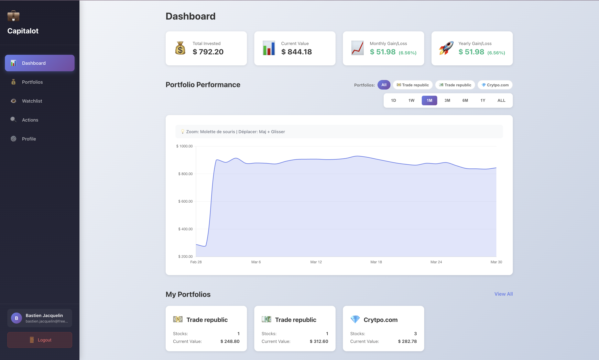
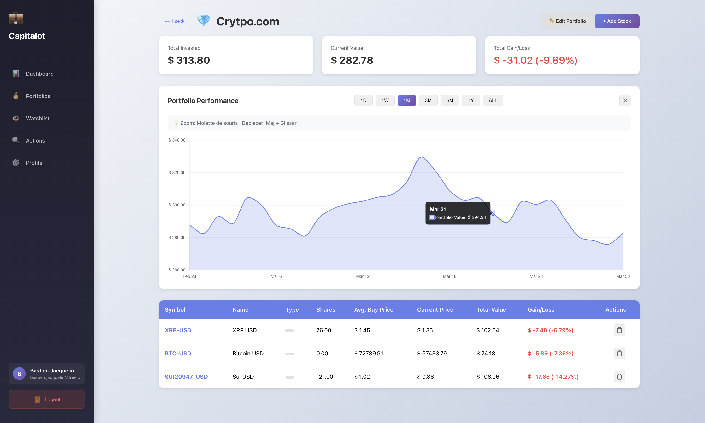
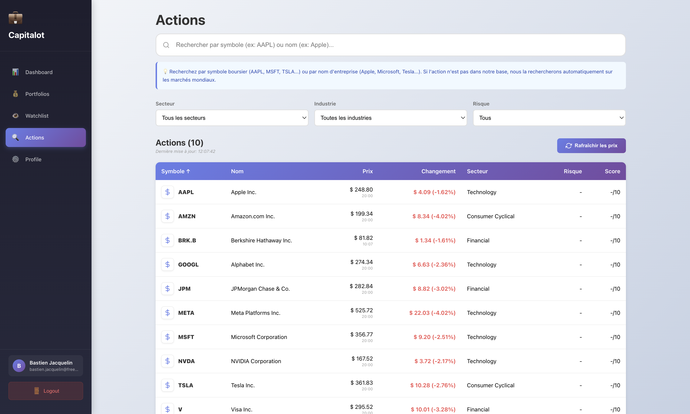
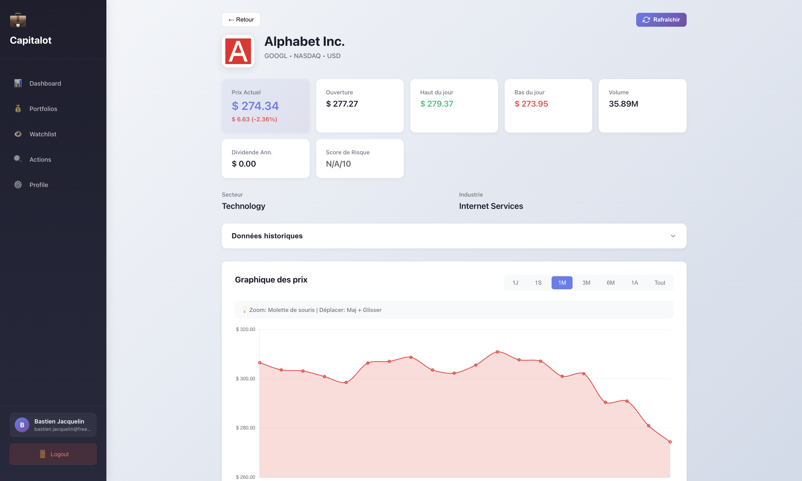
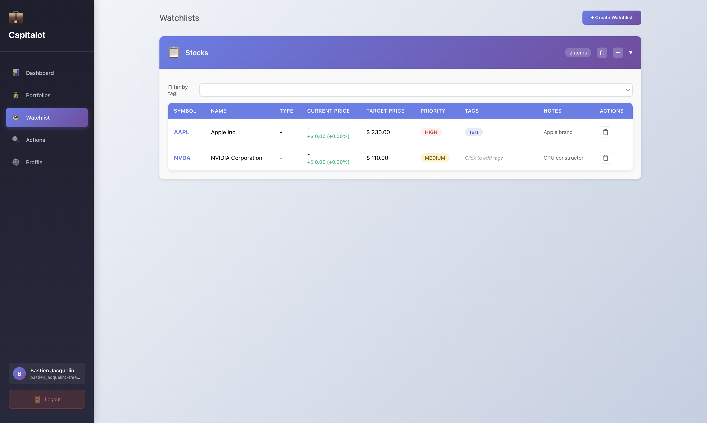
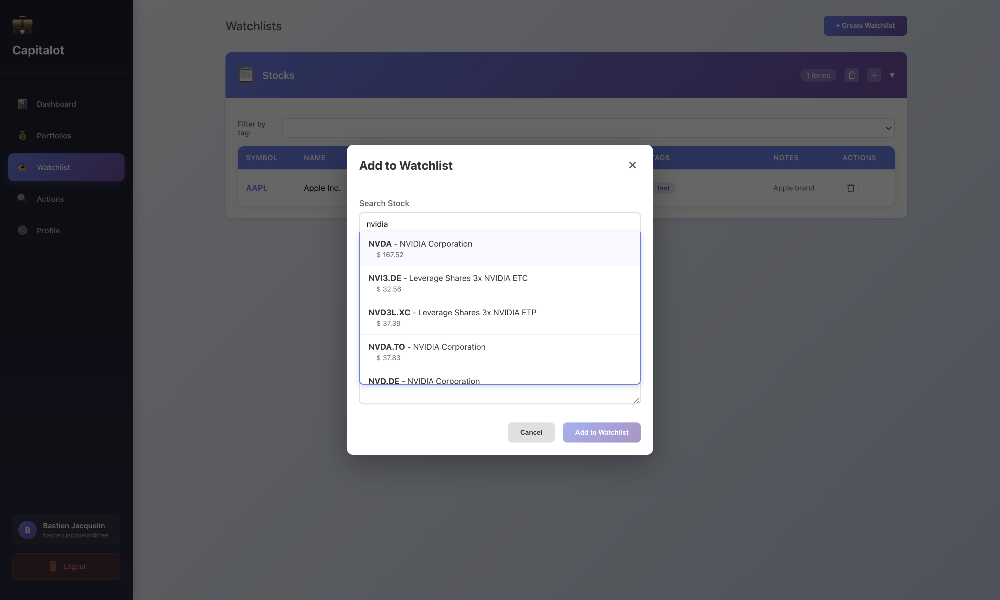
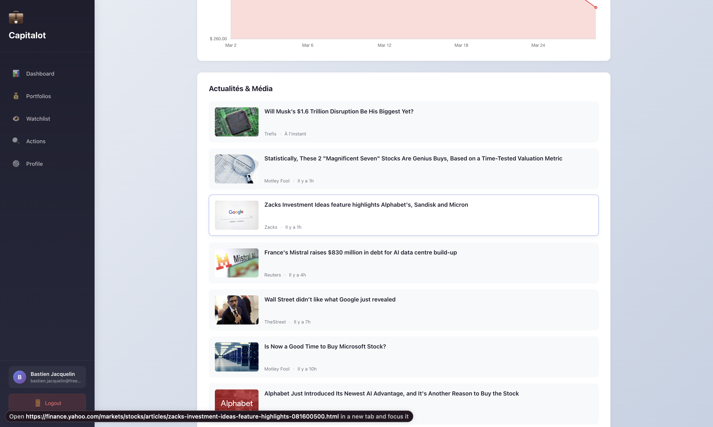
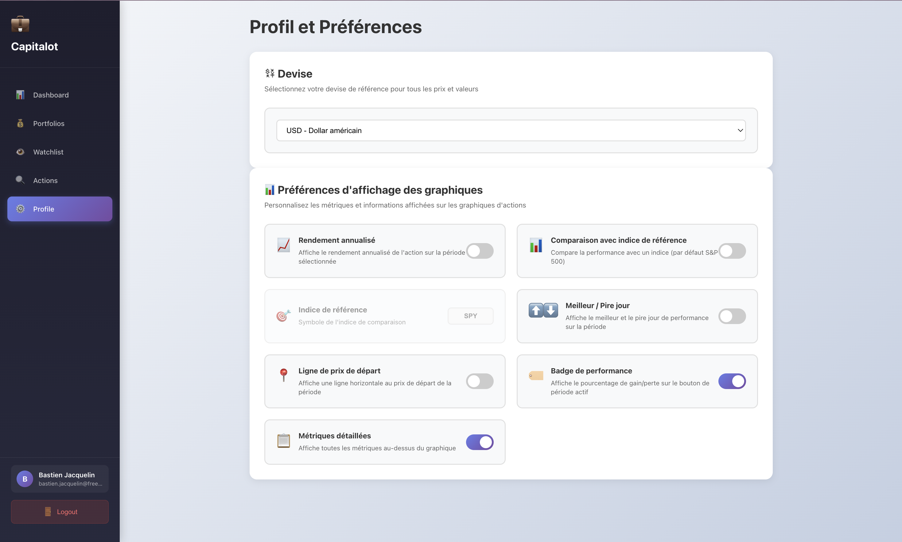

# Capitalot - Smart Investment Portfolio Tracker



**Transform Your Investment Journey with Capitalot**  
*Where Your Money Works Smarter, Not Harder*

Capitalot is your ultimate companion for mastering the stock market. Whether you're a seasoned investor or just starting out, our intuitive platform empowers you to track, analyze, and optimize your investment portfolios with real-time data and powerful analytics.

## 🚀 What Capitalot Does For You

Capitalot revolutionizes portfolio management by providing:

- **📊 Real-Time Portfolio Tracking**: Monitor your investments 24/7 with live stock prices and performance metrics
- **🎯 Smart Watchlists**: Never miss an opportunity with customizable watchlists and instant alerts
- **📈 Performance Analytics**: Deep insights into your portfolio's performance across daily, monthly, yearly, and all-time periods
- **🏷️ Intelligent Organization**: Tag and categorize your stocks for better portfolio organization
- **🔒 Secure & Private**: Your financial data stays yours with enterprise-grade security

## 💡 How It Works

### 1. **Create Your Portfolio**
Start by building personalized portfolios tailored to your investment strategy.



### 2. **Discover & Track Stocks**
Search thousands of stocks worldwide and add them to your portfolio with purchase details.



### 3. **Monitor Performance**
Get detailed analytics and performance statistics to make informed decisions.



### 4. **Build Watchlists**
Keep an eye on potential investments with flexible watchlists.




### 5. **Stay Informed**
Access the latest market news and company insights directly in the app.



### 6. **Customize Your Experience**
Personalize the app to match your preferences and workflow.



## 🔧 Powerful API Integrations

Capitalot leverages industry-leading financial APIs to deliver accurate, real-time data:

### **Yahoo Finance API** - Primary Data Provider
- **Stock Search**: Instant search across global markets with company profiles
- **Real-Time Prices**: Live stock quotes and historical data
- **Market Data**: Comprehensive financial metrics and company information

### **Finnhub API** - Enhanced Analytics (Optional)
- **Advanced Metrics**: Detailed financial ratios and performance indicators
- **Company Profiles**: In-depth business information and sector analysis
- **Market News**: Curated financial news and market insights

### **Google OAuth2** - Secure Authentication
- **One-Click Login**: Seamless authentication with your Google account
- **Enhanced Security**: Industry-standard OAuth2 implementation

## 🛠️ Tech Stack

### Backend (Spring Boot)
- **Framework**: Spring Boot 3.2.0 with Spring Security & JWT
- **Database**: PostgreSQL 16 with JPA/Hibernate
- **API**: RESTful endpoints with comprehensive documentation

### Frontend (Vue.js)
- **Framework**: Vue.js 3 with TypeScript
- **UI**: Modern, responsive design with intuitive navigation
- **State Management**: Pinia for reactive data handling

### Infrastructure
- **Containerization**: Docker & Docker Compose for easy deployment
- **Reverse Proxy**: Nginx for optimized frontend serving
- **Development**: Hot-reload development environments

## 🚀 Quick Start

Get Capitalot running in minutes:

```bash
git clone <repository-url>
cd capitalot
cp .env.example .env
docker-compose up -d
```

Visit **http://localhost:4200** and start investing smarter!

**Demo Account**:  
Email: demo@capitalot.com  
Password: password

## 📋 Key Features

### Portfolio Management
- Create unlimited portfolios
- Track purchase price, quantity, and dates
- Calculate gains/losses automatically
- Multi-portfolio support for different strategies

### Advanced Analytics
- Daily, monthly, yearly performance
- All-time portfolio statistics
- Visual performance charts
- Comparative analysis tools

### Stock Discovery
- Global stock search
- Real-time price updates
- Company profiles and metrics
- Market news integration

### Security & Privacy
- JWT-based authentication
- OAuth2 Google integration
- Secure data encryption
- Private financial data storage

## 🔌 API Endpoints Overview

### Authentication
- `POST /api/auth/register` - Create new account
- `POST /api/auth/login` - Secure login
- `GET /api/auth/oauth2/authorization/google` - Google OAuth login

### Portfolio Operations
- `GET /api/portfolios` - View all portfolios
- `POST /api/portfolios` - Create new portfolio
- `POST /api/portfolios/{id}/stocks` - Add stocks to portfolio

### Watchlist Management
- `GET /api/watchlists` - Access watchlists
- `POST /api/watchlists` - Create watchlist
- `POST /api/watchlists/{id}/stocks` - Add stocks to watch

### Stock Data
- `GET /api/stocks/search` - Search global stocks
- `GET /api/stocks/{symbol}/price` - Get live prices

### Analytics
- `GET /api/stats/performance` - Portfolio analytics

## 💼 Why Choose Capitalot?

- **User-Friendly**: Intuitive interface designed for all experience levels
- **Real-Time Data**: Always up-to-date with market changes
- **Comprehensive**: Everything you need in one platform
- **Secure**: Your data is protected with bank-level security
- **Fast**: Lightning-quick performance with modern architecture
- **Free**: Start tracking your investments without any cost

## 🏆 Perfect For

- **Individual Investors**: Manage personal portfolios with ease
- **Day Traders**: Real-time data for quick decisions
- **Long-term Investors**: Track performance over time
- **Financial Advisors**: Organize client portfolios
- **Students**: Learn investing with real market data

## 📞 Get Started Today

Ready to take control of your investments? Capitalot makes portfolio management simple, powerful, and profitable.

**Start your journey to smarter investing now!** 🚀

---

*Capitalot - Where Smart Investors Thrive*

## Testing

### Backend Tests
```bash
cd backend
./mvnw test
```

### Frontend Tests
```bash
cd frontend
npm test
```

## Contributing

1. Fork the repository
2. Create a feature branch (`git checkout -b feature/amazing-feature`)
3. Commit your changes (`git commit -m 'Add amazing feature'`)
4. Push to the branch (`git push origin feature/amazing-feature`)
5. Open a Pull Request

## Roadmap

- [ ] Integrate real stock price API
- [ ] Add portfolio detail view with charts
- [ ] Implement stock price history tracking
- [ ] Add transaction history
- [ ] Create performance visualization charts
- [ ] Add portfolio diversification analysis
- [ ] Implement email notifications
- [ ] Add mobile responsive design
- [ ] Create export functionality (CSV, PDF)
- [ ] Add multi-currency support

## License

This project is licensed under the MIT License - see the [LICENSE](LICENSE) file for details.

## Support

For questions or issues, please open an issue on GitHub.
